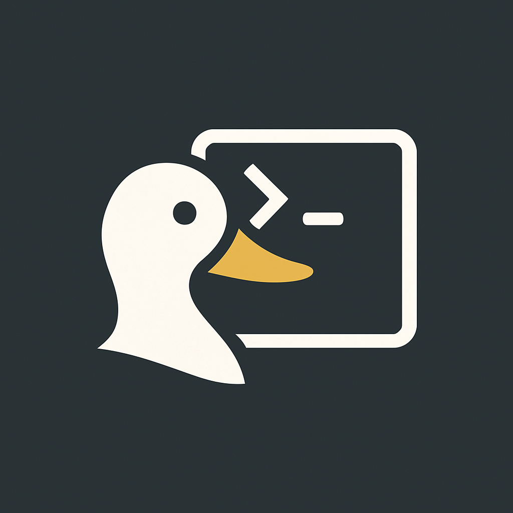

<p align="center">
  
</p>

# 🐧 DuckConsole – Ambiente Dev Isolado via Docker

O **DuckConsole** é um terminal de desenvolvimento completo, portátil e totalmente isolado via Docker.  
Ele replica o ambiente que você usa localmente — mas roda com segurança em qualquer Linux, sem interferir no seu sistema real.

Feito para desenvolvedores que trabalham com **Python, Rust, TypeScript, PostgreSQL, SSH, Neovim** e outras ferramentas modernas.

---

## ⚙️ Tecnologias e ferramentas instaladas

✅ Ambientes:

- `Zsh` com `Oh My Zsh`
- `Neovim` (configuração custom via [My-NeoVim](https://github.com/PheFreire/My-NeoVim))
- `tmux`, `fzf`, `direnv`

✅ Python:

- `Python 3.x`
- `pyenv` (gerenciador de versões)
- `poetry` (gerenciador de dependências)
- `pyright` (type checker)

✅ JavaScript / Node:

- `nvm` (gerenciador de Node)
- `Node LTS`
- `yarn` e `typescript`

✅ Rust:

- `rustup` (instalador do Rust)
- `cargo`

✅ Outros:

- `make`
- `catimg`
- `ripgrep`
- `postgresql-client`
- `openssh-client` (com suporte a forwarding de chave SSH)
- `docker CLI` (opcional via volume do host)

---

## 🔒 Segurança e isolamento

- Todo o ambiente roda **dentro de um container Docker**
- **Nenhuma instalação ou alteração no sistema real**
- Os arquivos do host só são acessíveis se você montar explicitamente com `-v`
- Suporte ao `ssh-agent` sem expor suas chaves privadas
- Usuário dentro do container usa o **mesmo UID/GID do host**, evitando problemas com permissões

---

## 🧰 Requisitos do sistema

| Requisito | Versão mínima |
|----------|----------------|
| Linux    | Ubuntu 20.04+ ou compatível |
| Docker   | v20.10+        |
| make     | qualquer versão |
| git, curl | qualquer versão |

---

## 📦 Instalação completa

### 1. Clone o repositório

```bash
git clone https://github.com/PheFreire/DuckConsole.git
cd DuckConsole
```

### 2. Rode o setup automático

```bash
make setup
```

O que esse comando faz:

- Instala o Docker (caso ainda não esteja instalado)
- Adiciona seu usuário ao grupo `docker`
- Cria um alias global `term` no seu shell (zsh/bash)
- Prepara o `.zshrc` usado no container

**⚠️ Você pode precisar reiniciar a sessão ou rodar `newgrp docker` para aplicar permissões.**

---

## 🚀 Uso no dia a dia

### Para iniciar o terminal (de qualquer lugar):

```bash
term
```

> Ele abrirá o terminal no diretório atual, com todos os recursos configurados.

---

## 🔑 Suporte a SSH e Docker CLI

### Forward de chave SSH (recomendado)

```bash
eval "$(ssh-agent -s)"
ssh-add ~/.ssh/<sua_key>
```

> O terminal terá acesso via `ssh-agent` e poderá fazer push/pull do GitHub.

---

## 🛠️ Comandos disponíveis no Makefile

| Comando         | O que faz |
|----------------|-----------|
| `make build`   | Gera a imagem Docker personalizada |
| `make term`    | Roda o terminal Docker no diretório atual |
| `make setup`   | Instala Docker, configura alias e permissões |
| `make clean`   | Remove arquivos temporários de build |
| `make prepare-zshrc` | Gera `.zshrc` dentro da pasta `build/` (usado pelo Dockerfile) |

---

## 📁 Estrutura do projeto

```
.
├── build/
│   └── .zshrc                # .zshrc usado dentro do container
├── .zshrc                    # Modelo base para build
├── .env                      # Variáveis do projeto
├── Dockerfile                # Define todo o ambiente Docker
├── Makefile                  # Scripts automatizados
└── README.md                 # Documentação completa
```

---

## ✨ Autor

Criado por [PheFreire](https://github.com/PheFreire) — feito com foco em produtividade, isolamento e portabilidade.

---

## 📜 Licença

MIT — sinta-se livre para adaptar e melhorar.
